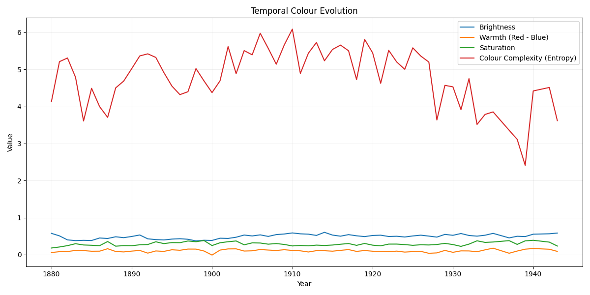

---

### Analiza slik Edvard-a Munch-a

#### predmet Osnove oblikovanja na FRI, dodiplomski študij, april 2026

#### Avtorja: Martin Malenšek, Urša Vavpotič

---

Slike so zbrane in dostopna na [kaggle spletni strani](https://www.kaggle.com/datasets/isaienkov/edvard-munch-paintings).

---

Sorodna dela:

[Computational color analysis of paintings for different artists of the XVI and XVII centuries](https://onlinelibrary.wiley.com/doi/10.1002/col.22211)

[Large-Scale Quantitative Analysis of Painting Arts](https://pmc.ncbi.nlm.nih.gov/articles/PMC4263068/)

---

Rezultat prototipa:

---
