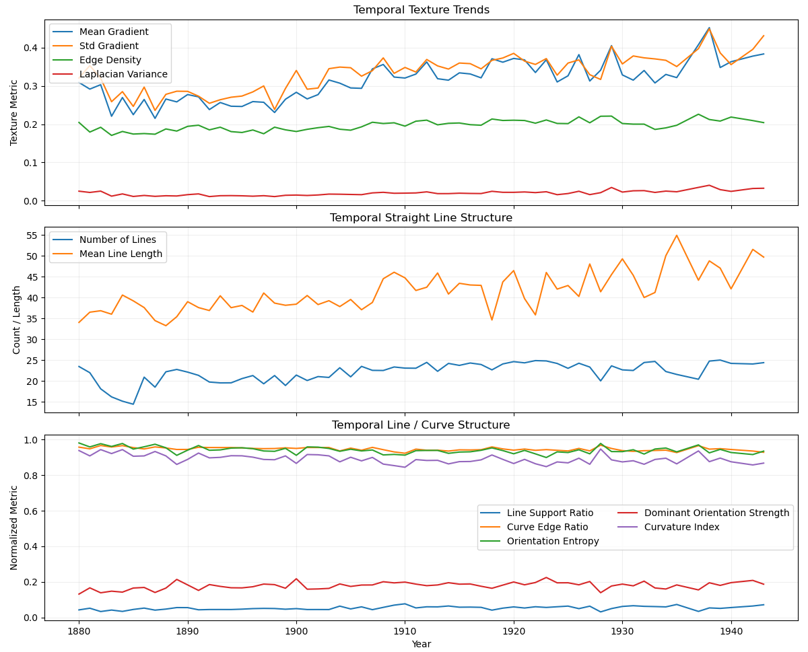

---

### Analiza slik Edvard-a Munch-a

#### predmet Osnove oblikovanja na FRI, dodiplomski študij, april 2026

#### Avtorja: Martin Malenšek, Urša Vavpotič

---

Slike so zbrane in dostopne na [kaggle spletni strani](https://www.kaggle.com/datasets/isaienkov/edvard-munch-paintings).

---

**Sorodna dela:**

[Large-Scale Quantitative Analysis of Painting Arts](https://pmc.ncbi.nlm.nih.gov/articles/PMC4263068/)
- uporaba barv: kako pogosto se pojavijo specifične barve
- barvna raznolikost
- svetlost in moč kontrasta

[The Sky in Edvard Munch’s The Scream](https://journals.ametsoc.org/view/journals/bams/99/7/bams-d-17-0144.1.xml?tab_body=pdf)
- analiza vzorcev in barv neba na sliki "Krik"
---

**Rezultat časovne analize:**

Barva analiza


Analiza robov in ravnih linij/krivulj



---

## Zagon

Namesti odvisnosti (v venv/conda env):

```bash
python3 -m pip install -r requirements.txt
```

### Časovna analiza

Zagon glavne skripte za časovno analizo (primeri):

```bash
# barva + tekstura
python3 casovna_analiza.py --start 1 --end 100 --folder ../../munch_paintings --csv ../data/edvard_munch.csv --mode both

# samo barva
python3 casovna_analiza.py --start 1 --end 100 --mode color

# samo edge/tekstura
python3 casovna_analiza.py --start 1 --end 100 --mode edge
```

Opombe:
- Privzeti `--folder` je `../../munch_paintings` in privzeti `--csv` je `../data/edvard_munch.csv` 
- `--mode` je lahko `color`, `edge`, ali `both`.


### Analiza posameznih slik

Vizualizacija prevladajočih in najpomembnejših barv na posameznih slikah.

``` bash
python3 analiza_ene_slike.py --start 1 --end 10 --folder ../../munch_paintings
```

#### Vizualizacija vmesnih korakov pri tej analizi - pomembne barve

``` bash
python3 visualize_superpixels.py --sample

# specifična slika
python3 visualize_superpixels.py ../../munch_paintings/10.jpg
```
